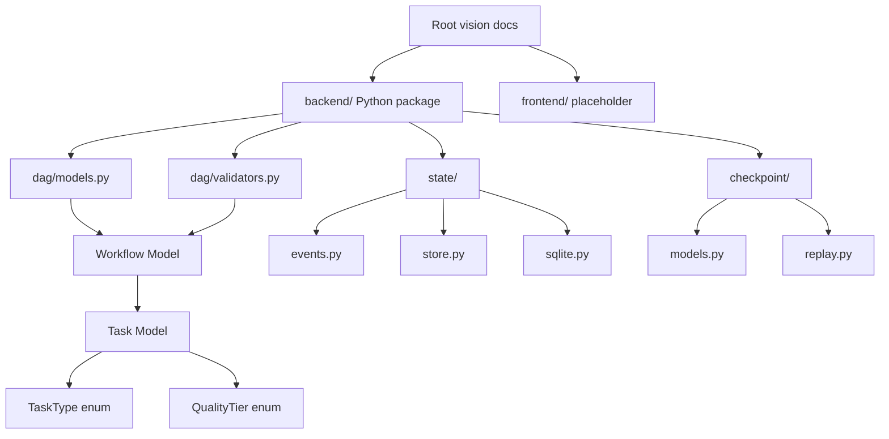
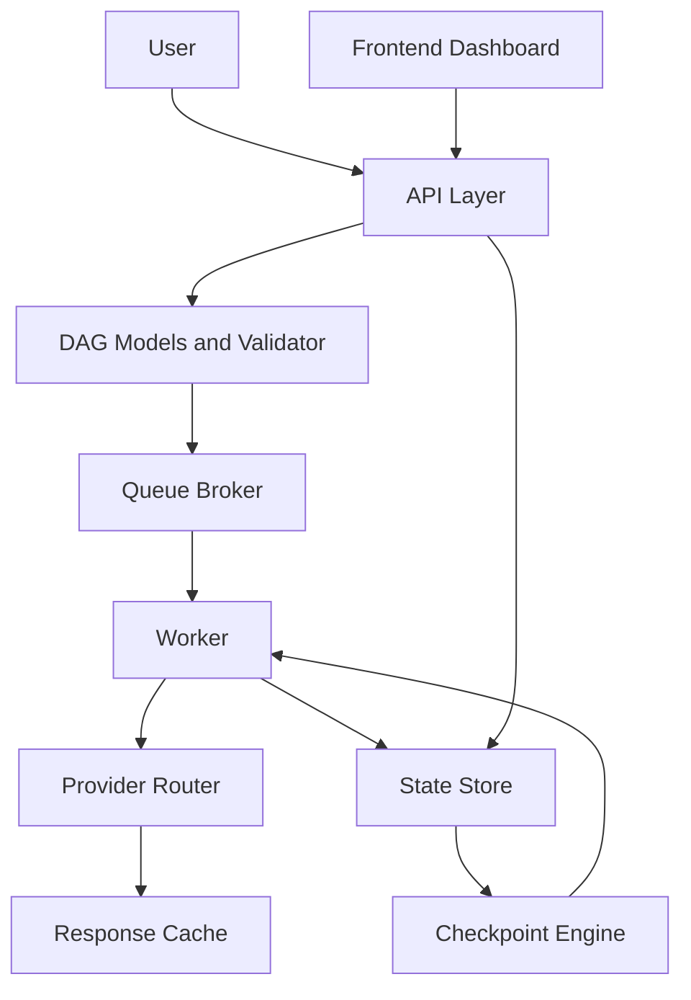

# Architecture

[[README|Knowledge Base Home]] > Architecture

Ather OS is structured as a future full-stack system with a Python [[Backend]] execution engine and a future [[Frontend]] dashboard. The current repository implements the earliest backend domain schema layer, structural workflow graph validation, a local append-only [[State Store]] foundation, and [[Checkpoint Engine]] replay.

## Current Architecture

The active code paths are importable schema code under [[DAG Models]], structural validation under [[DAG Validator]], append-only event persistence under [[State Store]], and event replay under [[Checkpoint Engine]]. There is no running API app, no queue, no worker, no provider router, and no frontend application code yet.

## Intended Architecture

The package structure and project documents point to this planned design:

This diagram is architectural intent, not current runtime behavior. Today, [[DAG Models]], [[DAG Validator]], [[State Store]], and [[Checkpoint Engine]] exist as real implementation.

## Module Responsibilities

- [[04_APIs|API Layer]]: package exists at `backend/src/ather_os/api`, but contains only a docstring.
- [[Response Cache]]: package exists at `backend/src/ather_os/cache`, but no interface or implementation exists.
- [[Checkpoint Engine]]: implemented with workflow/task status projection models and pure event replay logic.
- [[Configuration]]: package exists at `backend/src/ather_os/config`, but no settings model or environment loading exists.
- [[DAG Models]]: implemented in `backend/src/ather_os/dag/models.py`.
- [[DAG Validator]]: implemented in `backend/src/ather_os/dag/validators.py`.
- [[Provider Router]]: package exists at `backend/src/ather_os/providers`, but no router or mock provider exists.
- [[Queue Broker]]: package exists at `backend/src/ather_os/queue`, but no queue implementation exists.
- [[State Store]]: implemented with lifecycle event models, a minimal storage protocol, and a local SQLite event store.
- [[Worker]]: package exists at `backend/src/ather_os/worker`, but no execution loop exists.

## Data Flow

Current data flow supports in-memory validation when a developer instantiates [[Workflow Model]] or [[Task Model]] through Pydantic, then calls [[DAG Validator]] to validate dependency structure. After that, lifecycle events can be appended to and listed from [[State Store]], then replayed by [[Checkpoint Engine]] into workflow/task snapshots. There is still no API request flow or execution loop.

Planned data flow is documented as:

1. User submits a goal through [[04_APIs|APIs]] or future [[Frontend]].
2. Orchestrator creates or receives a [[Workflow Model]].
3. Each [[Task Model]] declares dependencies and context needs.
4. [[Queue Broker]] schedules executable tasks.
5. [[Worker]] executes tasks through [[Provider Router]].
6. [[State Store]] appends task events. This append-only portion now exists locally through SQLite.
7. [[Checkpoint Engine]] replays events into workflow/task snapshots. This in-memory replay portion now exists; worker restart behavior does not.

## Dependencies

Current runtime dependencies from `backend/pyproject.toml`:

- FastAPI
- Pydantic
- Uvicorn

Current development dependency:

- Pytest

Pydantic and the Python standard library are used by the current source code. The [[State Store]] uses the standard `sqlite3` module. FastAPI and Uvicorn are installed for planned [[04_APIs|API]] work but are not imported by application code.

## Related

- [[00_Project_Overview|Project Overview]]
- [[02_Folder_Structure|Folder Structure]]
- [[03_Database|Database]]
- [[04_APIs|APIs]]
- [[06_State_Management|State Management]]
- [[10_Current_Status|Current Status]]
