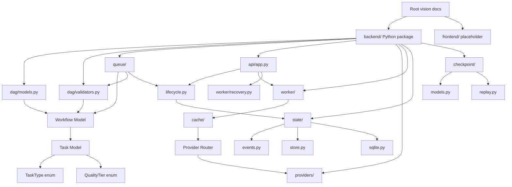
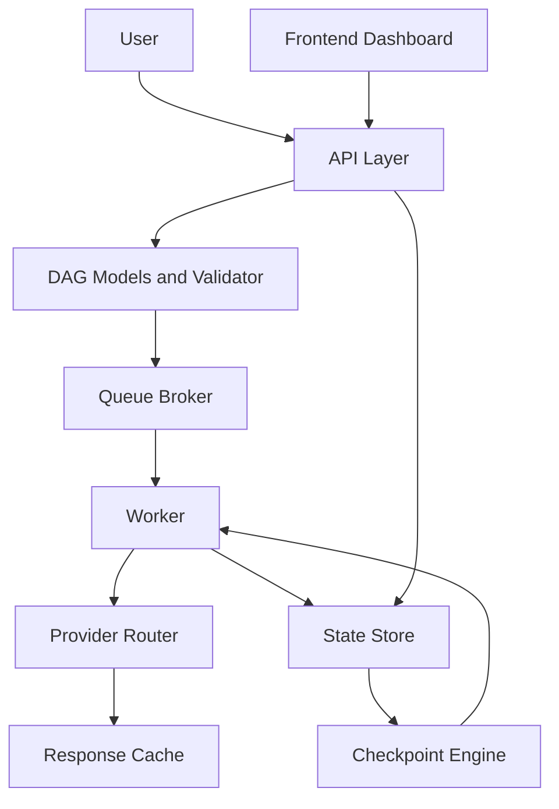

# Architecture

[[README|Knowledge Base Home]] > Architecture

Ather OS is structured as a future full-stack system with a Python [[Backend]] execution engine and a future [[Frontend]] dashboard. The current repository implements a local backend path from HTTP workflow submission through validation, scheduling, deterministic provider execution, event persistence, and replay-backed status retrieval.

## Current Architecture

The active code paths include [[DAG Models]], structural validation under [[DAG Validator]], append-only event persistence under [[State Store]], event replay under [[Checkpoint Engine]], local in-memory task scheduling under [[Queue Broker]], a process-local [[Response Cache]], a single-provider [[Provider Router]], a deterministic provider, a sequential [[Worker]], explicit checkpoint recovery, and a FastAPI application. [[Queue Lifecycle Service]] connects queue transitions with the event store; the API composes those pieces into a synchronous local request flow. There is still no multi-provider routing policy or frontend application code.

## Intended Architecture

The package structure and project documents point to this planned design:

This diagram is architectural intent, not current runtime behavior. Today, [[DAG Models]], [[DAG Validator]], [[State Store]], and [[Checkpoint Engine]] exist as real implementation.

## Module Responsibilities

- [[04_APIs|API Layer]]: implemented in `backend/src/ather_os/api/app.py` with submission and status routes.
- [[Response Cache]]: `InMemoryResponseCache` and `CachedTaskProvider` reuse successful equivalent provider outputs during one app process. Cache contents are not persisted.
- [[Checkpoint Engine]]: implemented with workflow/task status projection models and pure event replay logic.
- [[Configuration]]: package exists at `backend/src/ather_os/config`, but no settings model or environment loading exists.
- [[DAG Models]]: implemented in `backend/src/ather_os/dag/models.py`.
- [[DAG Validator]]: implemented in `backend/src/ather_os/dag/validators.py`.
- [[Provider Router]]: `ProviderRouter` selects a provider, while `SingleProviderRouter` currently selects the one configured local provider for every task.
- [[Queue Broker]]: implemented with a minimal protocol, dependency-aware in-memory queue, and [[Queue Lifecycle Service]] for local event emission.
- [[State Store]]: implemented with lifecycle event models, a minimal storage protocol, and a local SQLite event store.
- [[Worker]]: `WorkflowWorker` executes queued tasks sequentially through a provider; `WorkflowRecovery` reconstructs an unfinished workflow's queue from persisted events when explicitly requested.

## Data Flow

Current data flow starts when the API receives a [[Workflow Model]]. [[Queue Lifecycle Service]] validates and submits it to [[Queue Broker]], appends lifecycle events to [[State Store]], and lets [[Worker]] claim and execute ready tasks through the process-local [[Response Cache]], [[Provider Router]], and deterministic provider. Stored events are replayed by [[Checkpoint Engine]] into workflow/task snapshots returned by the API.

Planned data flow is documented as:

1. User submits a goal through [[04_APIs|APIs]] or future [[Frontend]].
2. Orchestrator creates or receives a [[Workflow Model]].
3. Each [[Task Model]] declares dependencies and context needs.
4. [[Queue Broker]] schedules executable tasks.
5. [[Worker]] executes tasks through [[Provider Router]].
6. [[State Store]] appends task events. This append-only portion now exists locally through SQLite.
7. [[Checkpoint Engine]] replays events into workflow/task snapshots. `WorkflowRecovery` uses those snapshots to resume local interrupted workflows on demand.

## Dependencies

Current runtime dependencies from `backend/pyproject.toml`:

- FastAPI
- Pydantic
- Uvicorn

Current development dependency:

- httpx
- Pytest

Pydantic, FastAPI, and the Python standard library are used by the current source code. The [[State Store]] uses the standard `sqlite3` module. Uvicorn runs the local API, and httpx supports API tests.

## Related

- [[00_Project_Overview|Project Overview]]
- [[02_Folder_Structure|Folder Structure]]
- [[03_Database|Database]]
- [[04_APIs|APIs]]
- [[06_State_Management|State Management]]
- [[10_Current_Status|Current Status]]
