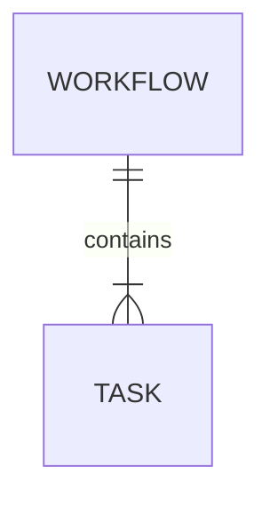

# Database

[[README|Knowledge Base Home]] > Database

There is no database implementation in the current codebase.

## Current State

The repository contains a `backend/src/ather_os/state/` package with this docstring: "State storage interfaces and implementations." No interfaces, models, migrations, SQLite connections, PostgreSQL clients, SQLAlchemy models, or database schemas exist.

The `.gitignore` excludes `*.db`, `*.sqlite`, and `*.sqlite3`, which suggests local SQLite files are expected later but should not be committed.

## Implemented Data Models

The implemented data structures are Pydantic request/domain schemas in [[DAG Models]], plus structural validation in [[DAG Validator]]:

- [[Workflow Model]]
- [[Task Model]]
- [[TaskType]]
- [[QualityTier]]

These are not database tables. They are in-memory validation models defined in `backend/src/ather_os/dag/models.py` and validation logic defined in `backend/src/ather_os/dag/validators.py`.

## Planned Storage Model

The project vision describes event sourcing, where task state changes are appended as events instead of overwritten. Planned concepts include:

- [[State Store]]
- [[Checkpoint Engine]]
- Task events such as TaskClaimed, TaskExecuted, TaskSucceeded, TaskFailed, and TaskRetried
- Response cache records
- Workflow replay from an event log

None of these event models or tables currently exist in code.

## Model Relationships

Current implemented relationship:

This diagram represents the Pydantic containment relationship only:

- [[Workflow Model]] has a `tasks: list[Task]`.
- [[Task Model]] has `dependencies: list[UUID]` referencing other task IDs.
- There is no database foreign key enforcement.

## Missing Database Work

- Define [[State Store]] interface.
- Choose local SQLite implementation.
- Add event schema.
- Add workflow/task persistence if needed.
- Add replay queries for [[Checkpoint Engine]].
- Add tests for idempotent recovery.

## Related

- [[01_Architecture|Architecture]]
- [[06_State_Management|State Management]]
- [[05_Components|Components]]
- [[11_Tasks|Tasks]]
- [[12_Bugs|Bugs]]
