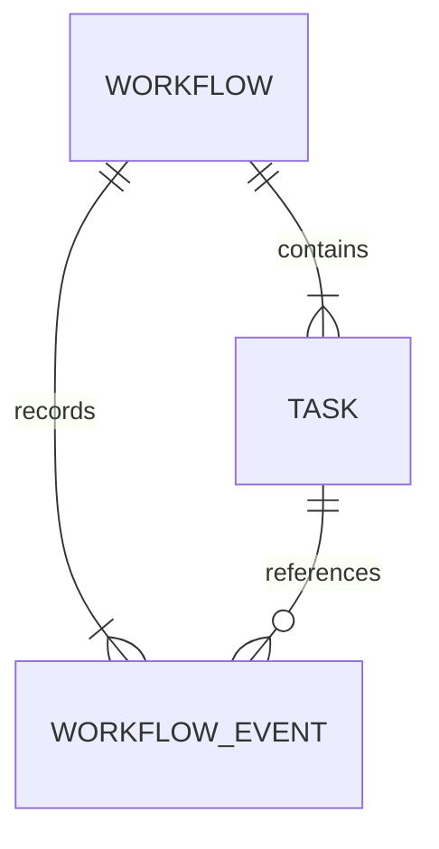

# Database

[[README|Knowledge Base Home]] > Database

The current database implementation is a minimal local SQLite event store.

## Current State

The repository contains a [[State Store]] implementation under `backend/src/ather_os/state/`.

Implemented files:

- `events.py`: workflow/task lifecycle event models.
- `store.py`: minimal append/list state store protocol.
- `sqlite.py`: SQLite-backed append-only event store.

No PostgreSQL clients, SQLAlchemy models, migrations, workflow tables, task tables, or projection tables exist.

The `.gitignore` excludes `*.db`, `*.sqlite`, and `*.sqlite3`, which suggests local SQLite files are expected later but should not be committed.

## Implemented Data Models

The implemented data structures are Pydantic request/domain schemas in [[DAG Models]], plus structural validation in [[DAG Validator]]:

- [[Workflow Model]]
- [[Task Model]]
- [[TaskType]]
- [[QualityTier]]

These are not database tables. They are in-memory validation models defined in `backend/src/ather_os/dag/models.py` and validation logic defined in `backend/src/ather_os/dag/validators.py`.

## Implemented Storage Model

The implemented storage model is event sourcing, where workflow and task state changes are appended as events instead of overwritten.

The SQLite table is `workflow_events` and stores:

- append sequence
- event ID
- workflow ID
- optional task ID
- event type
- occurrence timestamp
- full JSON event payload

The current event names are simpler than the early vision language: `task_queued`, `task_started`, `task_completed`, and `task_failed`.

[[Checkpoint Engine]] replay, response cache records, and derived workflow/task status projections are still planned.

## Model Relationships

Current implemented relationship:

This diagram represents the Pydantic containment relationship only:

- [[Workflow Model]] has a `tasks: list[Task]`.
- [[Task Model]] has `dependencies: list[UUID]` referencing other task IDs.
- [[State Store]] events reference workflow and task IDs as text in SQLite.
- There is no database foreign key enforcement.

## Missing Database Work

- Add replay queries for [[Checkpoint Engine]].
- Add workflow/task status projections.
- Add event idempotency policy beyond unique event IDs.
- Add tests for idempotent recovery.

## Related

- [[01_Architecture|Architecture]]
- [[06_State_Management|State Management]]
- [[05_Components|Components]]
- [[11_Tasks|Tasks]]
- [[12_Bugs|Bugs]]
