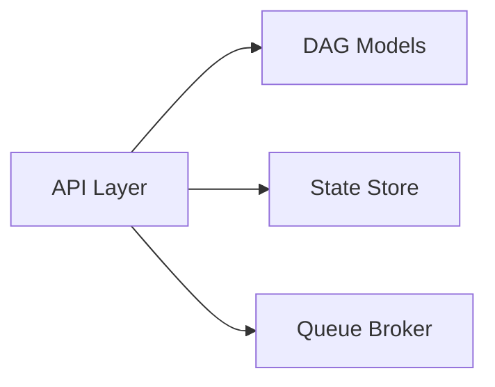

# APIs

[[README|Knowledge Base Home]] > APIs

The local FastAPI application is implemented in
`backend/src/ather_os/api/app.py`.

## Current State

`create_app(database_path, provider)` wires a local SQLite [[State Store]],
in-memory [[Queue Broker]], [[Queue Lifecycle Service]], process-local
[[Response Cache]], deterministic mock provider, [[Worker]], and replay-backed
[[Checkpoint Engine]] query.

The module exports `app`, so it can be run from `backend/` with:

```powershell
.\.venv\Scripts\uvicorn.exe ather_os.api.app:app --reload
```

The default local event database is `ather-os.sqlite3` in the working directory.

## Routes

### `POST /workflows`

Accepts a [[Workflow Model]], validates its graph, persists lifecycle events,
executes it synchronously with the deterministic mock provider, and returns a
`WorkflowSnapshot`.

- `201 Created`: workflow completed or failed during local execution.
- `409 Conflict`: the workflow ID already exists.
- `422 Unprocessable Content`: Pydantic request validation or graph validation
  failed.

### `GET /workflows/{workflow_id}`

Loads events from the [[State Store]] and returns their replayed
`WorkflowSnapshot`.

- `200 OK`: persisted workflow found.
- `404 Not Found`: no stored workflow exists for the ID.

### `POST /workflows/{workflow_id}/recover`

Replays persisted events, reconstructs the in-memory queue, and resumes an
unfinished local workflow. A task interrupted after `task_started` may run
again with the next attempt number.

- `200 OK`: returns the resulting replayed snapshot.
- `404 Not Found`: no stored workflow exists for the ID.
- `422 Unprocessable Content`: the persisted submission event cannot provide a
  workflow definition needed for recovery.

## Intended Dependencies



This relationship is implemented for synchronous local execution.

## Tests

`backend/tests/test_api.py` covers successful submission, persisted status
retrieval through a new app instance, invalid graph rejection, unknown workflow
lookup, and duplicate workflow IDs.

## Current Limits

- Execution is synchronous within the `POST` request.
- Recovery is explicit; the app does not automatically resume unfinished
  workflows at startup.
- The only provider is deterministic and local.
- There is no authentication, event-list endpoint, or API versioning.
- Cache contents last only for the app process and are not shared with a new app
  instance or restored during recovery.

## Related

- [[01_Architecture|Architecture]]
- [[05_Components|Components]]
- [[06_State_Management|State Management]]
- [[07_Authentication|Authentication]]
- [[11_Tasks|Tasks]]
