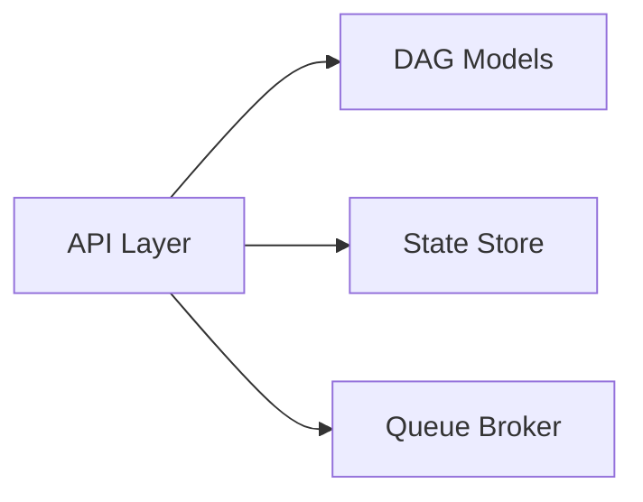

# APIs

[[README|Knowledge Base Home]] > APIs

There are no implemented HTTP API routes in the current codebase.

## Current State

`backend/src/ather_os/api/__init__.py` exists and contains only a package docstring: "HTTP API layer for Ather OS." There is no FastAPI app instance, no `APIRouter`, no endpoint function, and no server entrypoint.

FastAPI and Uvicorn are listed as dependencies in `backend/pyproject.toml`, but the audited source code does not import either.

## Planned API Responsibility

Based on the project README and backend README, the API layer is intended to provide endpoints for:

- Submitting workflows.
- Inspecting workflow status.
- Viewing task and event progress.

These planned endpoints would likely accept or return [[Workflow Model]] and [[Task Model]] objects, but no route contracts currently exist.

## Current API Calls

None.

No page, component, service, or worker calls an API because neither the [[Frontend]] nor the backend API implementation exists yet.

## Intended Dependencies

This relationship is planned only. Current source-level dependency is absent.

## Missing API Work

- Create FastAPI application entrypoint.
- Define request and response schemas.
- Add endpoint for workflow submission.
- Add endpoint for workflow inspection.
- Connect API routes to [[State Store]] and [[Queue Broker]] once those exist.
- Add API tests.

## Related

- [[01_Architecture|Architecture]]
- [[05_Components|Components]]
- [[06_State_Management|State Management]]
- [[07_Authentication|Authentication]]
- [[11_Tasks|Tasks]]
