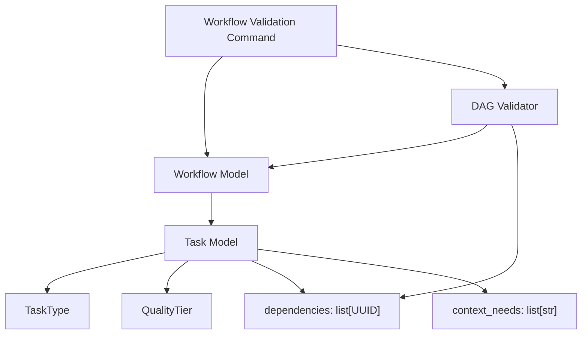

# Components

[[README|Knowledge Base Home]] > Components

This project currently has backend domain components only. There are no frontend UI components.

## Implemented Backend Components

### DAG Models

Implemented in `backend/src/ather_os/dag/models.py`.

[[DAG Models]] define the workflow schema used by the intended execution engine:

- [[TaskType]]: enum of allowed task kinds.
- [[QualityTier]]: enum of output quality levels.
- [[Task Model]]: a single executable node in a workflow graph.
- [[Workflow Model]]: a collection of tasks tied to one goal.
- [[DAG Validator]]: structural validation for workflow task dependencies.
- Workflow validation command: loads sample workflow JSON and runs schema plus graph validation.

### TaskType

`TaskType` is a `StrEnum` with these values:

- `research`
- `code_generation`
- `writing`
- `analysis`
- `validation`

[[Task Model]] depends on [[TaskType]] through its `type` field.

### QualityTier

`QualityTier` is a `StrEnum` with these values:

- `draft`
- `standard`
- `polished`

[[Task Model]] depends on [[QualityTier]] through its `quality_tier` field. The default value is `standard`.

### Task Model

`Task` is a Pydantic `BaseModel` with:

- `task_id: UUID`
- `type: TaskType`
- `prompt: str` with minimum length 1
- `dependencies: list[UUID]` defaulting to an empty list
- `context_needs: list[str]` defaulting to an empty list
- `estimated_tokens: int` greater than 0 and less than or equal to 8000
- `quality_tier: QualityTier` defaulting to `standard`
- `max_retries: int` defaulting to 2 and greater than or equal to 0

The `dependencies` field relates a task to other task IDs in the same [[Workflow Model]]. [[DAG Validator]] verifies that these relationships form a valid executable graph.

### Workflow Model

`Workflow` is a Pydantic `BaseModel` with:

- `workflow_id: UUID`
- `goal: str` with minimum length 1
- `tasks: list[Task]` with minimum length 1 and maximum length 20

[[Workflow Model]] depends on [[Task Model]] because it contains the task list.

### DAG Validator

Implemented in `backend/src/ather_os/dag/validators.py`.

[[DAG Validator]] exposes:

- `validate_workflow_graph(workflow: Workflow) -> None`
- `DagValidationError`

The validator checks:

- Duplicate task IDs.
- Dependencies that reference unknown task IDs.
- Tasks that depend on themselves.
- Dependency cycles.
- Exactly one root task with no dependencies.
- Reachability from the root task through dependency edges.

[[DAG Validator]] depends on [[Workflow Model]] and [[Task Model]]. It does not persist state and does not execute tasks; it only proves that a workflow graph is structurally safe for future [[Queue Broker]], [[Worker]], and [[Checkpoint Engine]] logic.

### Workflow Validation Command

Implemented in `backend/src/ather_os/dag/validate_workflow.py`.

The command helper exposes:

- `load_workflow_file(path: Path) -> Workflow`
- `validate_workflow_file(path: Path) -> Workflow`
- `main(argv: Sequence[str] | None = None) -> int`

It uses the existing [[DAG Models]] and [[DAG Validator]] rather than introducing a separate validation path. It can be run from `backend/` with:

```powershell
.\.venv\Scripts\python.exe -m ather_os.dag.validate_workflow .\samples\valid_research_workflow.json
```

The command is intentionally minimal. It validates local JSON samples only; it does not submit workflows, persist state, or execute tasks.

## Placeholder Backend Component Boundaries

The following backend packages exist but contain no executable implementation:

- [[04_APIs|APIs]]: `backend/src/ather_os/api`
- [[Response Cache]]: `backend/src/ather_os/cache`
- [[Checkpoint Engine]]: `backend/src/ather_os/checkpoint`
- [[Configuration]]: `backend/src/ather_os/config`
- [[Provider Router]]: `backend/src/ather_os/providers`
- [[Queue Broker]]: `backend/src/ather_os/queue`
- [[State Store]]: `backend/src/ather_os/state`
- [[Worker]]: `backend/src/ather_os/worker`

## Frontend Components

Not applicable yet. The [[Frontend]] has only `frontend/README.md`; there are no pages, components, hooks, styles, services, or assets.

## Relationship Summary



## Related

- [[01_Architecture|Architecture]]
- [[03_Database|Database]]
- [[04_APIs|APIs]]
- [[06_State_Management|State Management]]
- [[08_UI_System|UI System]]
