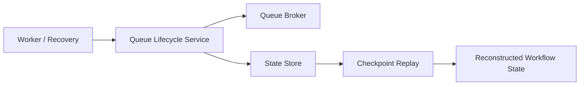

# State Management

[[README|Knowledge Base Home]] > State Management

State management is partially implemented.

## Current State

The backend now has an append-only local [[State Store]] foundation:

- Typed lifecycle event models in `backend/src/ather_os/state/events.py`.
- A minimal `StateStore` protocol in `backend/src/ather_os/state/store.py`.
- A SQLite-backed implementation in `backend/src/ather_os/state/sqlite.py`.
- [[Checkpoint Engine]] projection models and event replay in `backend/src/ather_os/checkpoint`.
- [[Queue Lifecycle Service]] coordination between local queue transitions and lifecycle events.
- Explicit [[Checkpoint Engine]]-backed worker recovery for interrupted local workflows.

There is still no frontend state management or automatic startup recovery. The
API queues process-local background execution and exposes status, event
inspection, and explicit recovery routes.

[[Workflow Model]] and [[Task Model]] instances are still validated in memory before state is persisted. Pydantic validates field shape, and [[DAG Validator]] validates dependency structure before future stateful execution systems rely on it.

## Backend State Boundaries

The repository contains package placeholders for planned state-related systems:

- [[State Store]] at `backend/src/ather_os/state`
- [[Checkpoint Engine]] at `backend/src/ather_os/checkpoint`
- [[Queue Broker]] at `backend/src/ather_os/queue`
- [[Response Cache]] at `backend/src/ather_os/cache`

[[State Store]], [[Checkpoint Engine]], [[Queue Broker]], and [[Response Cache]] have real implementation. The cache is deliberately process-local rather than event-sourced state.

## Intended Event-Sourced Flow

The project vision describes append-only task events and replay:

The append-event and list-events portions are implemented in [[State Store]]. In-memory replay is implemented in [[Checkpoint Engine]]. [[Queue Lifecycle Service]] emits submission, queue, start, and successful completion events while delegating readiness decisions to [[Queue Broker]]. On recovery, the replayed snapshot restores completed and ready work; an interrupted running task is requeued at the next attempt.

## Frontend State

Not applicable. The [[Frontend]] has no application code or state library.

## Relationships

- [[Task Model]] currently stores `dependencies`, `context_needs`, retry budget, quality tier, and estimated token count.
- [[Workflow Model]] groups tasks under a workflow ID and goal.
- [[DAG Validator]] verifies that workflow dependencies are executable before future state transitions are recorded.
- [[State Store]] persists workflow and task lifecycle events.
- [[Checkpoint Engine]] reconstructs current workflow/task status from persisted events.
- [[Queue Broker]] determines which [[Task Model]] instances are executable based on completed dependencies.
- [[Queue Lifecycle Service]] coordinates the local queue with append-only events; [[Worker]] recovery rebuilds that local queue from persisted state when invoked.
- [[Response Cache]] can reuse a successful provider output during one app process, but cache entries are neither persisted nor recovered.

## Missing State Work

- Add automatic recovery on service startup once ownership and concurrency rules exist.
- Add retry-budget enforcement, task leases, and timeout handling.

## Related

- [[03_Database|Database]]
- [[05_Components|Components]]
- [[01_Architecture|Architecture]]
- [[11_Tasks|Tasks]]
