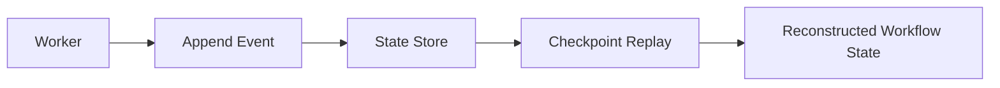

# State Management

[[README|Knowledge Base Home]] > State Management

State management is planned but not implemented.

## Current State

There is no application state store, no frontend state management, no database-backed state, and no event replay engine.

The only state-like structure in current source code is data carried by [[Workflow Model]] and [[Task Model]] instances. Pydantic validates this data in memory, and [[DAG Validator]] validates dependency structure before future stateful execution systems rely on it.

## Backend State Boundaries

The repository contains package placeholders for planned state-related systems:

- [[State Store]] at `backend/src/ather_os/state`
- [[Checkpoint Engine]] at `backend/src/ather_os/checkpoint`
- [[Queue Broker]] at `backend/src/ather_os/queue`
- [[Response Cache]] at `backend/src/ather_os/cache`

Each currently contains only an `__init__.py` docstring.

## Intended Event-Sourced Flow

The project vision describes append-only task events and replay:

This flow is not implemented yet.

## Frontend State

Not applicable. The [[Frontend]] has no application code or state library.

## Relationships

- [[Task Model]] currently stores `dependencies`, `context_needs`, retry budget, quality tier, and estimated token count.
- [[Workflow Model]] groups tasks under a workflow ID and goal.
- [[DAG Validator]] verifies that workflow dependencies are executable before future state transitions are recorded.
- Future [[State Store]] should persist workflow and task events derived from [[DAG Models]].
- Future [[Checkpoint Engine]] should reconstruct current task status from persisted events.
- Future [[Queue Broker]] should determine which [[Task Model]] instances are executable based on dependencies.

## Missing State Work

- Define event types.
- Define `StateStore` interface.
- Implement SQLite local storage.
- Implement replay logic.
- Add task status projection.
- Add tests for future dependency scheduling and recovery behavior.

## Related

- [[03_Database|Database]]
- [[05_Components|Components]]
- [[01_Architecture|Architecture]]
- [[11_Tasks|Tasks]]
