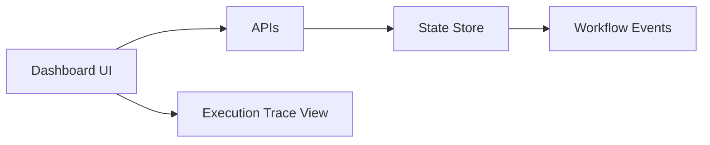

# UI System

[[README|Knowledge Base Home]] > UI System

There is no UI system implemented yet.

## Current Frontend State

The `frontend/` folder contains only `frontend/README.md`. It states that the frontend is a placeholder and that Phase 0 work is focused on proving the local backend execution engine.

There is no:

- Frontend framework.
- `package.json`.
- Routing system.
- Component library.
- Styling setup.
- Design tokens.
- Pages.
- API client.
- State management.
- Asset pipeline.

## Planned UI Responsibility

The future [[Frontend]] is expected to:

- Submit a workflow.
- Inspect workflow status.
- View task and event progress.
- Visualize execution traces.

These planned screens will depend on [[04_APIs|APIs]], [[06_State_Management|State Management]], and [[03_Database|Database]] projections once those exist.

## Current Component Relationships

Not applicable. There are no UI components or pages to map.

## Future Relationship Map

This is intended architecture only.

## Related

- [[02_Folder_Structure|Folder Structure]]
- [[04_APIs|APIs]]
- [[05_Components|Components]]
- [[10_Current_Status|Current Status]]
