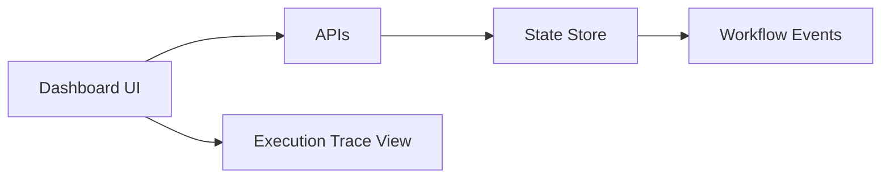

# UI System

[[README|Knowledge Base Home]] > UI System

The frontend is in its first feedback-driven implementation stage.

## Visual Direction

[[UI Direction]] records the agreed visual north star and stores four
user-provided inspiration references under `docs/ui-assets/inspiration/`. They
define the desired interface feel and reusable visual language, not a literal
screen design or product requirements. [[Frontend Delivery Plan]] defines the
review gates for turning this direction into the product UI.

## Current Frontend State

The `frontend/` folder now contains a dependency-free Stage 1 workflow
workspace prototype: `index.html`, `styles.css`, and `app.js`. It uses local
demo data and lets a reviewer select task cards to inspect their details.

There is no:

- Frontend framework or `package.json`.
- Routing system.
- Component library.
- Styling setup.
- Design tokens.
- Backend-connected pages.
- API client.
- Persistent frontend state management.
- Asset pipeline.

## Planned UI Responsibility

The future [[Frontend]] is expected to:

- Submit a workflow.
- Inspect workflow status.
- View task and event progress.
- Visualize execution traces.

These planned screens will depend on [[04_APIs|APIs]], [[06_State_Management|State Management]], and [[03_Database|Database]] projections once those exist.

## Current Component Relationships

Stage 1 has a static application shell, workflow board, task cards, task
inspector, and activity feed. See [[Frontend Delivery Plan]] for the stages
that add workflow creation and live backend data.

## Future Relationship Map

```mermaid
flowchart LR
    Dashboard["Dashboard UI"] --> API["APIs"]
    API --> State["State Store"]
    State --> Events["Workflow Events"]
    Dashboard --> Trace["Execution Trace View"]
```

This is intended architecture only.

## Related

- [[02_Folder_Structure|Folder Structure]]
- [[04_APIs|APIs]]
- [[05_Components|Components]]
- [[10_Current_Status|Current Status]]
- [[UI Direction]]
- [[Frontend Delivery Plan]]
