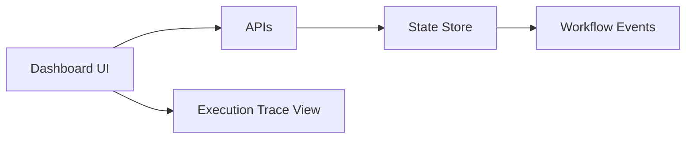

# UI System

[[README|Knowledge Base Home]] > UI System

The frontend is in its first feedback-driven implementation stage.

## Visual Direction

[[UI Direction]] records the agreed visual north star and stores four
user-provided inspiration references under `docs/ui-assets/inspiration/`. They
define the desired interface feel and reusable visual language, not a literal
screen design or product requirements. [[Frontend Delivery Plan]] defines the
review gates for turning this direction into the product UI.

## Current Frontend State

The `frontend/` folder contains a React and Vite workflow workspace:
`src/main.jsx`, `src/App.jsx`, `input.css`, and `vite.config.js`. Its dark
product navigation links a workspace summary, local draft builder, and visible
execution activity surface. React state keeps the summary, builder, live run,
event trace, and recovery action synchronized.

The Activity surface translates the local workflow snapshot into a completion
indicator and task cards. While a submitted run is active, it polls the
existing status and event endpoints, preserving the trace's append order. It
uses no additional client-side state layer beyond the active run's task-label
mapping.

There is no:

- Routing system.
- Component library.
- Design tokens.
- Persistent frontend state management.
- Asset pipeline.

## Planned UI Responsibility

The future [[Frontend]] is expected to:

- Submit a workflow.
- Inspect workflow status.
- View task and event progress.
- Visualize execution traces.

These planned screens will depend on [[04_APIs|APIs]], [[06_State_Management|State Management]], and [[03_Database|Database]] projections once those exist.

## Current Component Relationships

Stage 1 established the application shell and workflow board. Stage 2 replaces
the static board with a local workflow builder, a live structure preview, and a
workspace summary that makes the draft and next action legible before entering
the form. See [[Frontend Delivery Plan]] for the stage that adds backend data.

## Future Relationship Map

```mermaid
flowchart LR
    Dashboard["Dashboard UI"] --> API["APIs"]
    API --> State["State Store"]
    State --> Events["Workflow Events"]
    Dashboard --> Trace["Execution Trace View"]
```

This is intended architecture only.

## Related

- [[02_Folder_Structure|Folder Structure]]
- [[04_APIs|APIs]]
- [[05_Components|Components]]
- [[10_Current_Status|Current Status]]
- [[UI Direction]]
- [[Frontend Delivery Plan]]
